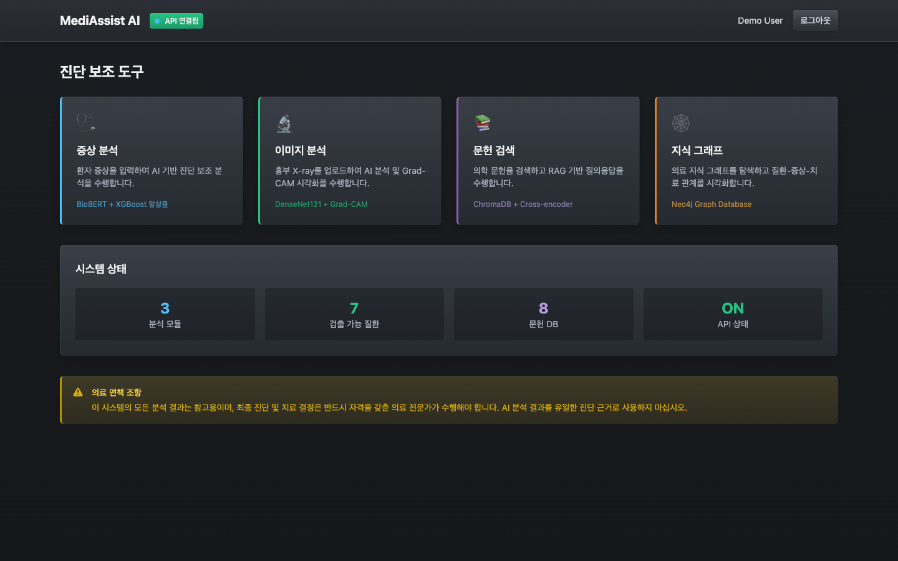
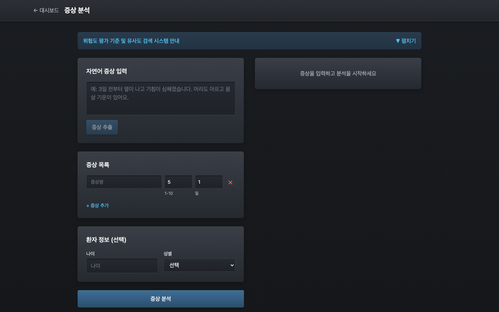
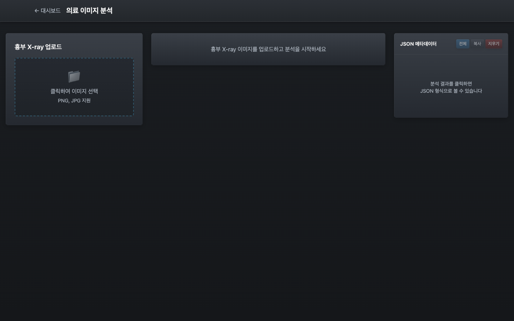
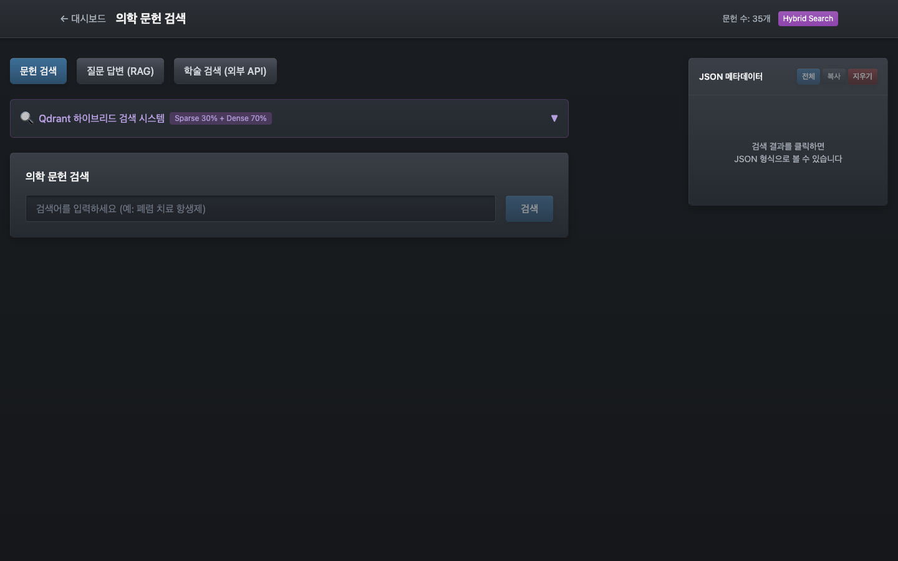
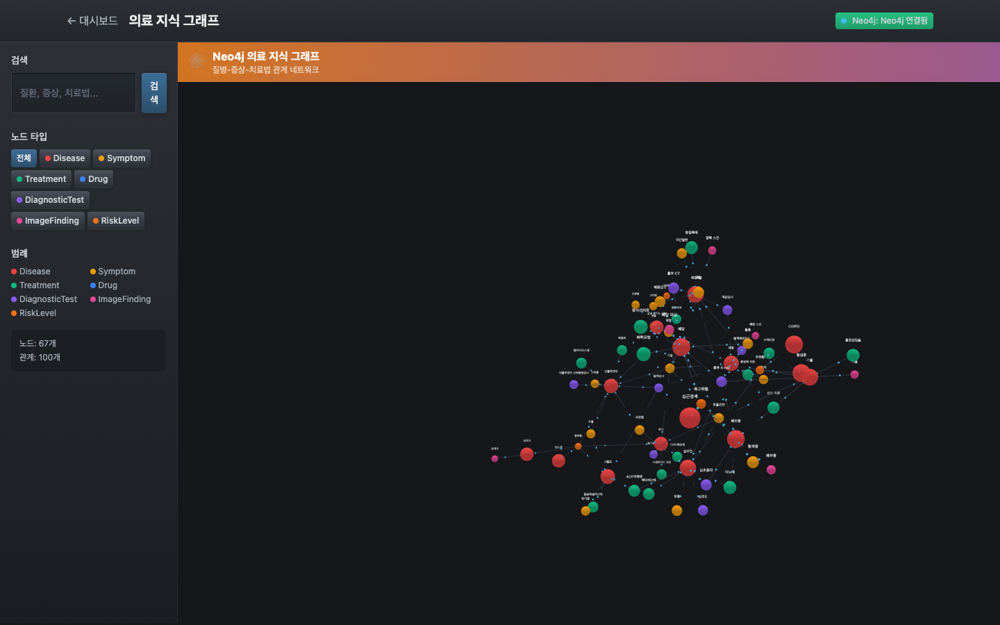
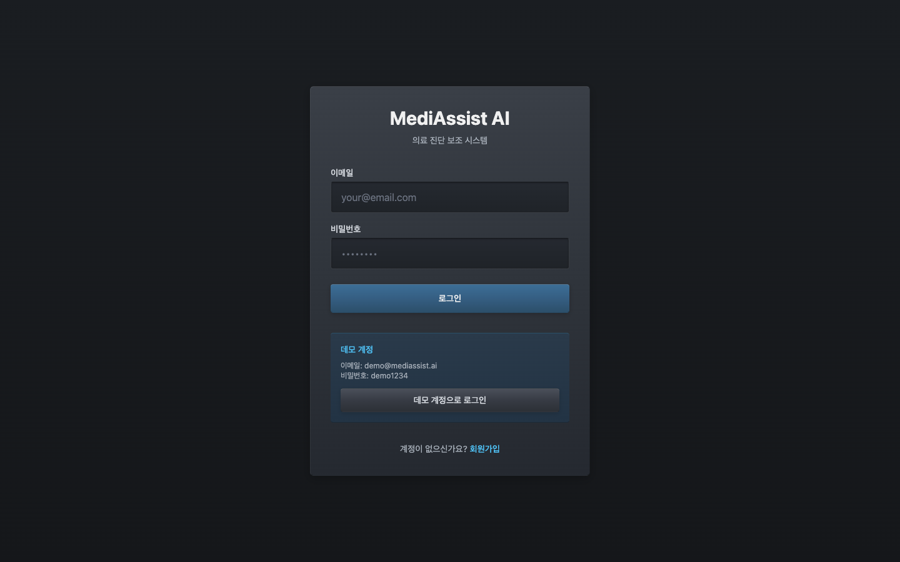

# MediAssist AI

[](https://github.com/david1005910/MediAssist-AI/actions/workflows/build.yml)
[](https://github.com/david1005910/MediAssist-AI/actions/workflows/test.yml)
[](https://github.com/david1005910/MediAssist-AI/actions/workflows/lint.yml)
[](https://opensource.org/licenses/MIT)
[](https://www.python.org/downloads/)
[](https://reactjs.org/)
[](https://www.typescriptlang.org/)

Medical RAG + ML 진단 보조 시스템

## Overview

MediAssist AI는 의료진이 환자 증상을 분석하고, 관련 의학 문헌을 검색하여 근거 기반 진단 의사결정을 지원하는 AI 시스템입니다.

## Screenshots

### Dashboard
메인 대시보드에서 모든 진단 보조 도구에 접근할 수 있습니다.



### Symptom Analysis (증상 분석)
자연어로 증상을 입력하면 AI가 자동으로 증상을 추출하고 가능한 질환을 예측합니다.



### Image Analysis (의료 이미지 분석)
흉부 X-ray를 업로드하면 DenseNet121 모델이 분석하고 Grad-CAM으로 관심 영역을 시각화합니다.



### Literature Search (문헌 검색)
Qdrant 하이브리드 검색(Sparse 30% + Dense 70%)으로 의학 문헌을 검색하고 RAG 기반 질의응답을 수행합니다.



### Knowledge Graph (지식 그래프)
Neo4j 기반 의료 지식 그래프를 3D로 탐색하며 질환-증상-치료법 관계를 시각화합니다.



### Login
Frosted Metal Aesthetic 디자인이 적용된 로그인 화면입니다.



## Features

- **증상 분석**: BioBERT + XGBoost 앙상블 모델을 사용한 증상 기반 질병 분류
- **의료 이미지 분석**: DenseNet121 기반 흉부 X-ray 분석 + Grad-CAM 시각화
- **RAG 문헌 검색**: Qdrant 하이브리드 검색 (Sparse BM25 + Dense BioBERT)
- **지식 그래프**: Neo4j 기반 질환-증상-치료법 관계 시각화
- **위험도 평가**: 환자 상태에 따른 위험도 점수 산출

## Tech Stack

- **Backend**: Python 3.11+, FastAPI, SQLAlchemy
- **Frontend**: React 18, TypeScript, TailwindCSS, Three.js
- **ML/AI**: PyTorch, XGBoost, BioBERT, DenseNet121
- **Vector DB**: Qdrant (Hybrid Search)
- **Graph DB**: Neo4j
- **Database**: PostgreSQL, Redis
- **Infrastructure**: Docker, Kubernetes

## Quick Start

```bash
# Clone the repository
git clone https://github.com/david1005910/MediAssist-AI.git
cd MediAssist-AI

# Copy environment file
cp .env.example .env

# Start development services
make dev

# Install dependencies
make install

# Run the analysis service
make run-analysis

# Run the frontend
make run-frontend
```

## Project Structure

```
MediAssist-AI/
├── services/           # Microservices
│   ├── auth/          # Authentication service
│   ├── patient/       # Patient management
│   ├── analysis/      # ML analysis service
│   └── report/        # Report generation
├── models/            # ML models
│   ├── symptom_classifier/  # BioBERT + XGBoost
│   ├── image_analyzer/      # DenseNet121 + Grad-CAM
│   └── risk_predictor/      # Risk assessment
├── rag/               # RAG system
│   ├── embedding/     # BioBERT embeddings
│   ├── retrieval/     # Hybrid search
│   ├── reranking/     # Cross-encoder
│   └── generation/    # Answer generation
├── frontend/          # React application
├── common/            # Shared code
├── tests/             # Tests
├── docs/              # Documentation
│   └── screenshots/   # UI screenshots
└── k8s/               # Kubernetes configs
```

## API Documentation

After starting the services, API documentation is available at:
- Auth Service: http://localhost:8001/docs
- Analysis Service: http://localhost:8003/docs

## Design

UI는 **Frosted Metal Aesthetic** 디자인 시스템을 사용합니다:
- 다크 메탈릭 그라디언트 배경
- 엣지 하이라이트와 인셋 섀도우
- 쿨톤 악센트 컬러 (Cyan, Green, Purple, Orange)

## Disclaimer

이 시스템의 모든 분석 결과는 참고용이며, 최종 진단 및 치료 결정은 반드시 자격을 갖춘 의료 전문가가 수행해야 합니다.

## License

MIT License
